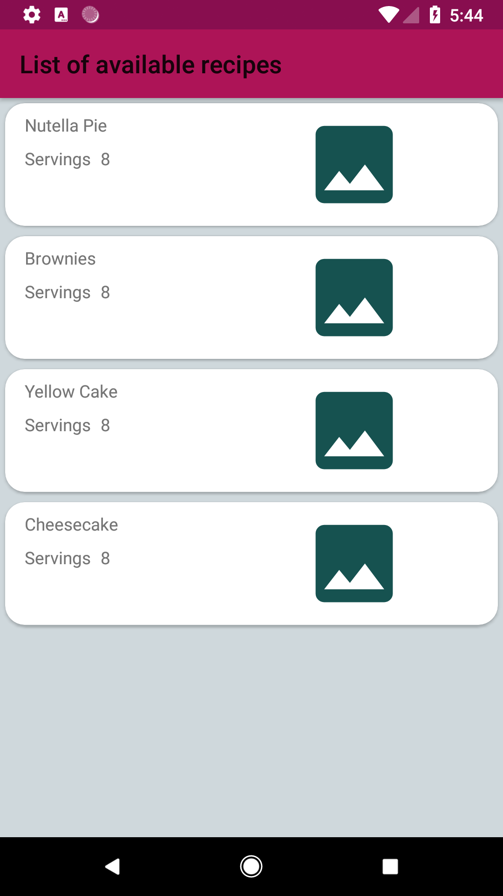
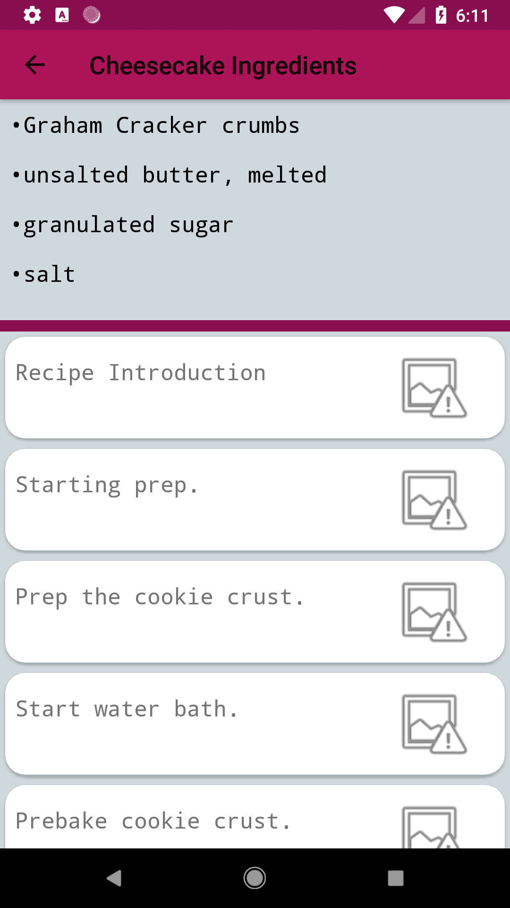
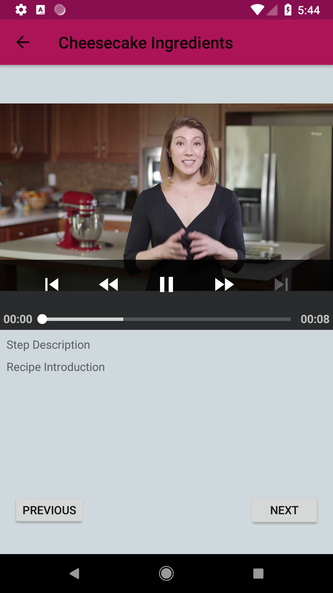

# BakeMe

This repository was created to complete a project for the *Udacity Android Developer* Nanodeegre program.

## Intro
What I built is an Android app that fetches some info from a fixed web endpoint and displays that info to the user. Then the user can interact with that info . The application comes along with a widget which displays a  piece of info the user  selected in the configuration activity. 

### Features

- Master / Detail flow for Tablets
- Companion Widget
- Error Handling ( *bad* data on purpose)

### Uses

- *Retrofit* for async Network calls to the web point
- *Picaso* for image loading
- *Room* for data perstistence
- *ExoPlayer* for video player
- *Gson* used along Retrofit to map JSON to Java objects

### Screenshots

